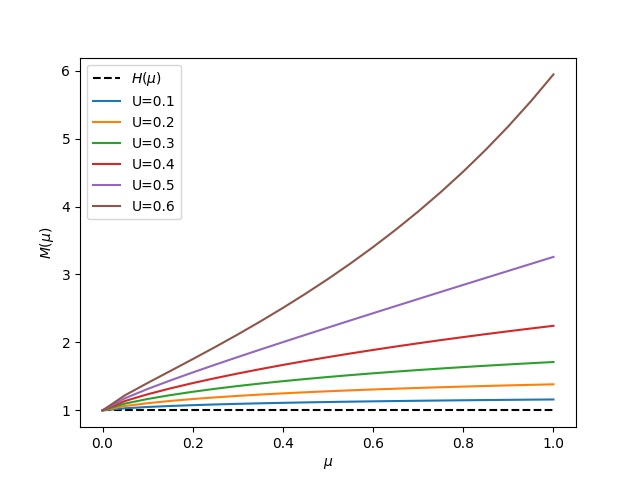

# M-function Evaluation

This code evaluates the values of the M(μ, U, ω)-function in all of its parameter space.  
The zero albedo case is the only possible analytical solution, whereas the `M_func.py` script is the most general version to calculate the triple-valued function using the Gauss–Legendre formula. The dependencies are Python with SciPy and NumPy installed in the system.

The `M_parameter_test.py` script provides a handle to the original `M_func.py` evaluation code.

A simplistic script for the analytical case is given in `M_func_albdo_0.py`.

All files must be located in the same folder for the code to work properly.
markdown
[Link Text](https://iopscience.iop.org/article/10.3847/1538-4357/ac8987/pdf)

---

<div style="display: flex; align-items: flex-start;">

<div style="flex: 1; padding: 10px;">

### Example Plot for Zero Albedo



</div>

<div style="flex: 1; padding: 10px; font-size: 12px;">

### Example Table corresponding to Zero Albedo 

| μ    | U=0.1  | U=0.2  | U=0.3  | U=0.4  | U=0.5  | U=0.6  | U=0.7  |
|:----:|:------:|:------:|:------:|:------:|:------:|:------:|:------:|
| 0    | 1.0000 | 1.0000 | 1.0000 | 1.0000 | 1.0000 | 1.0000 | 1.0000 |
| 0.05 | 1.0314 | 1.0648 | 1.1005 | 1.1387 | 1.1796 | 1.2235 | 1.2708 |
| 0.1  | 1.0504 | 1.1061 | 1.1681 | 1.2374 | 1.3154 | 1.4040 | 1.5054 |
| 0.15 | 1.0651 | 1.1392 | 1.2245 | 1.3235 | 1.4399 | 1.5789 | 1.7475 |
| 0.2  | 1.0772 | 1.1673 | 1.2739 | 1.4019 | 1.5585 | 1.7545 | 2.0068 |
| 0.25 | 1.0875 | 1.1918 | 1.3183 | 1.4747 | 1.6733 | 1.9336 | 2.2899 |
| 0.3  | 1.0965 | 1.2135 | 1.3586 | 1.5430 | 1.7854 | 2.1181 | 2.6032 |
| 0.35 | 1.1044 | 1.2330 | 1.3956 | 1.6077 | 1.8956 | 2.3093 | 2.9539 |
| 0.4  | 1.1114 | 1.2507 | 1.4299 | 1.6691 | 2.0044 | 2.5083 | 3.3506 |
| 0.45 | 1.1177 | 1.2668 | 1.4618 | 1.7278 | 2.1121 | 2.7162 | 3.8044 |
| 0.5  | 1.1234 | 1.2816 | 1.4916 | 1.7839 | 2.2188 | 2.9340 | 4.3295 |
| 0.55 | 1.1286 | 1.2952 | 1.5196 | 1.8378 | 2.3248 | 3.1628 | 4.9454 |
| 0.6  | 1.1334 | 1.3079 | 1.5458 | 1.8896 | 2.4301 | 3.4036 | 5.6785 |
| 0.65 | 1.1378 | 1.3196 | 1.5706 | 1.9395 | 2.5349 | 3.6579 | 6.5668 |
| 0.7  | 1.1418 | 1.3306 | 1.5941 | 1.9876 | 2.6393 | 3.9267 | 7.6662 |
| 0.75 | 1.1456 | 1.3408 | 1.6162 | 2.0341 | 2.7433 | 4.2117 | 9.0631 |
| 0.8  | 1.1491 | 1.3504 | 1.6373 | 2.0790 | 2.8469 | 4.5145 | 10.898 |
| 0.85 | 1.1524 | 1.3595 | 1.6574 | 2.1224 | 2.9503 | 4.8370 | 13.417 |
| 0.9  | 1.1554 | 1.3680 | 1.6764 | 2.1645 | 3.0534 | 5.1811 | 17.091 |
| 0.95 | 1.1583 | 1.3760 | 1.6946 | 2.2052 | 3.1562 | 5.5494 | 22.953 |
| 1    | 1.1609 | 1.3836 | 1.7120 | 2.2448 | 3.2589 | 5.9445 | 33.791 |

</div>
</div>

---

## Dependencies

This project requires:

- Python 3
- NumPy
- SciPy

Install using pip:

```bash
pip install numpy scipy


**# Citation**


